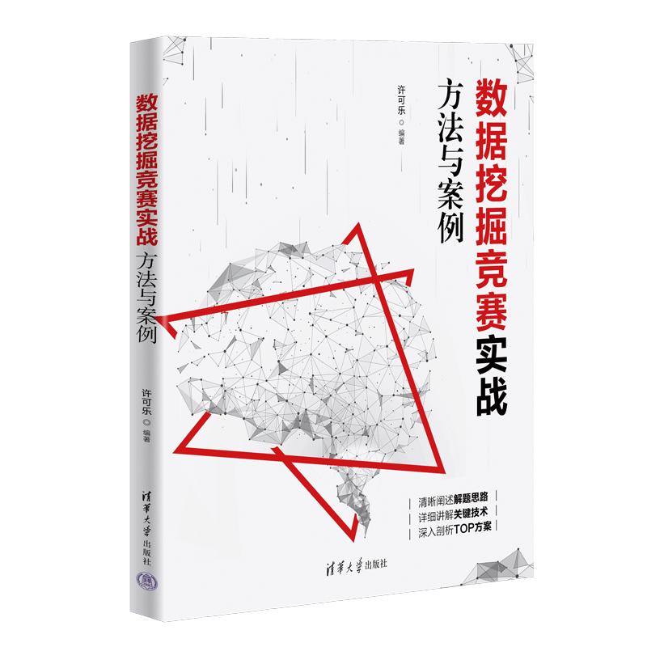

## Data Mining Competition: Practical Methods and Case Studies

Welcome to the official code repository for Algorithm Competition: Practical Machine Learning and Data Mining. This repository contains all code examples and project files introduced in the book.

## Environment Requirements and Usage
Please refer to the README.md file in each project directory for details.

Happy learning!
